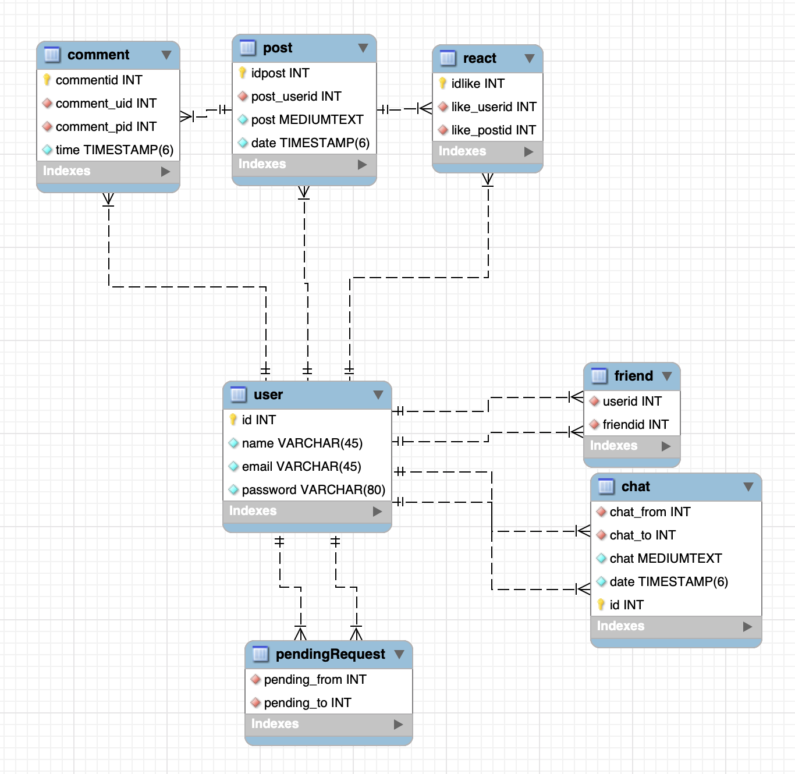

# Heroku
Describe:  
Current feature:  
- Login/ Signin  
- Post  
- Send/ Accept friend request  
- Chat ( need improvement on SocketIO and DB access time )  
- Like  
- Personal page

On develop:  
- Group  
- Share  
- Comment on post <- ( stuck at ReactJS side )

DB:  

Credit:  
Nguyen Hoang Viet --- hoangviet0502.giangvo@gmail.com  

Deployed on Heroku at : https://arcane-everglades-60566.herokuapp.com/  

Localhost:  
Install:  
`npm install && cd client && npm install`  
Run:  
`concurrently \"npm start\" \"cd client && npm start\"`  
or use two terminal at base folder and client folder and type `npm start`  
Note:  
- Require MySQL in localhost and change port in app.js ( default: 3306 )  
- Change port in both index.js and Messenger.js ( default: 8080 )  
- Change proxy if change index.js port in package.json in client

